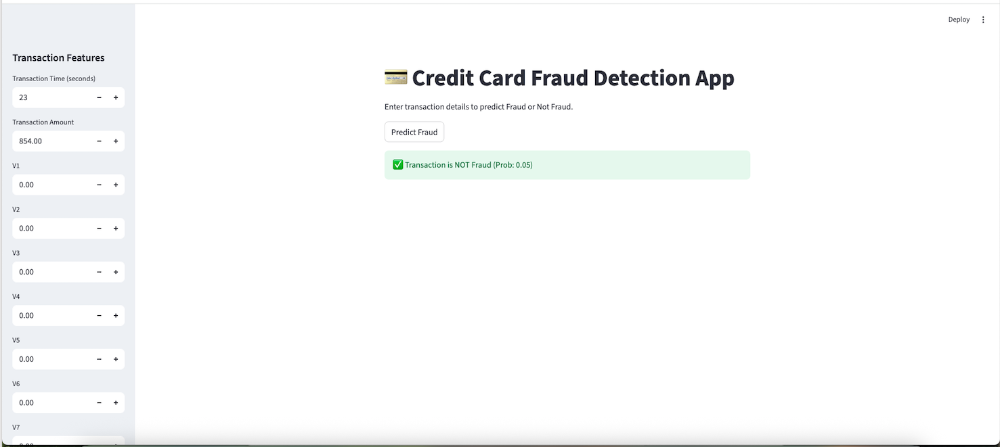

Absolutely ✅ — here’s a **comprehensive `README.md`** you can copy-paste directly into your repo. I’ve written it in a clean, professional way so it’s GitHub-ready.

---

# 💳 Credit Card Fraud Detection

A machine learning project to detect fraudulent credit card transactions using **Logistic Regression** and **Tree-based Models (Decision Trees, Random Forest, XGBoost)**. The best performing model, **XGBoost trained on SMOTE-balanced data**, is deployed via a **Streamlit web app**.

---

## 📌 Project Overview

Credit card fraud is a serious issue where fraudulent transactions are extremely rare compared to legitimate ones. This creates an **imbalanced classification problem** that requires careful data preprocessing and modeling strategies.

This project demonstrates:

* End-to-end **EDA & Data Cleaning**
* Handling **imbalanced data** with SMOTE
* Training and evaluating **baseline & advanced models**
* Deploying the best model with a **Streamlit web app**
* (Optional) steps to deploy on **AWS**

---

## 📂 Project Structure

```
.gitignore
README.md
requirements.txt
app/
    app.py
data/
    cleaned_creditcard.csv
    creditcard.csv
models/
    decision_tree_smote_model.joblib
    logistic_regression_baseline_model.joblib
    logistic_regression_smote_model.joblib
    random_forest_smote_model.joblib
    robust_scaler.joblib
    standard_scaler.joblib
    xgboost_smote_model.joblib
notebooks/
    01_EDA_and_Data_Cleaning.ipynb
    02_Modeling_and_Evaluation.ipynb
src/
    data_preprocessing.py
    model_loader.py
```
---

## 📊 Dataset

The dataset used is the **Credit Card Fraud Detection dataset** from [Kaggle](https://www.kaggle.com/mlg-ulb/creditcardfraud).

* **Rows**: 284,807 transactions
* **Fraudulent cases**: 492 (≈ 0.17%)
* Features are PCA-transformed (`V1`–`V28`), with `Time` and `Amount` preserved.
* Target variable:

  * `0` → Legitimate transaction
  * `1` → Fraudulent transaction

---

## ⚙️ Setup & Installation

Clone the repository and install dependencies:

```bash
git clone https://github.com/your-username/credit-card-fraud-detection.git
cd credit-card-fraud-detection

# Create virtual environment (optional but recommended)
python -m venv .venv
source .venv/bin/activate   # macOS/Linux
.venv\Scripts\activate      # Windows

# Install dependencies
pip install -r requirements.txt
```

---

## 📒 Notebooks

### 1️⃣ EDA & Data Cleaning (`01_EDA_and_Data_Cleaning.ipynb`)

* Data inspection, null values, duplicates
* Class imbalance visualization
* Feature correlations & distributions
* Outlier analysis
* Scaling of `Time` and `Amount`
* Export cleaned dataset

### 2️⃣ Model Training & Evaluation (`02_Modeling_and_Evaluation.ipynb`)

* Train baseline model on imbalanced data with Logistic Regression
* Evaluate with Precision, Recall, F1, ROC AUC
* Apply **SMOTE only on training set**
* Train Logistic Regression and tree-based models such as **Decision Tree, Random Forest, and XGBoost**
* Hyperparameter tuning using RandomizedSearchCV for XGBoost
* Evaluate with Precision, Recall, F1, ROC AUC
* Compare performance across models
* Save all models to `models/`

---

## 🚀 Running the Streamlit App

The Streamlit app allows you to input transaction details and predict whether a transaction is fraudulent.

### Start the app:

```bash
streamlit run app/app.py
```

### App Features:

* Sidebar form for inputting transaction features (`Time`, `Amount`, `V1`–`V28`)
* Prediction using trained **XGBoost model**
* Output with fraud probability

Example outputs:

* ✅ *Transaction is NOT Fraud (Prob: 0.05)*
* ⚠️ *Transaction is FRAUDULENT (Prob: 0.92)*

### 📺 Demo  

Here’s a quick demo of the fraud detection app in action:  

  

*(If GIF is too large, replace with a screenshot instead)*  

  

---

## 🧠 Model Insights

* **Logistic Regression (baseline)**: fast but limited decision boundary
* **Decision Trees**: interpretable but prone to overfitting
* **Random Forest**: better generalization, robust performance
* **XGBoost**: best overall, capturing complex fraud patterns

**Best model:**

* Algorithm: XGBoost with SMOTE
* Evaluation Metric: ROC AUC ≈ 0.99
* Saved model: `models/xgboost_smote_model.joblib`

---

## ☁️ (Optional) AWS Deployment

The app can be deployed on **AWS EC2** or **Elastic Beanstalk**.

Basic steps (EC2 example):

1. Launch an EC2 instance (Ubuntu)
2. SSH into instance
3. Install Python, pip, and requirements
4. Upload repo and model
5. Run Streamlit app:

   ```bash
   nohup streamlit run app.py --server.port 8080 &
   ```
6. Configure security group to allow inbound HTTP (port 8080)

---

## 📌 Key Learnings

* Real-world fraud detection requires **handling imbalance** (SMOTE, resampling)
* Evaluation must use the **original imbalanced test set** to reflect reality
* Ensemble methods (Random Forest, XGBoost) significantly outperform baseline logistic regression
* Deployment closes the loop, making ML models usable in real-world scenarios

---

## 👤 Author

Developed by **\[Your Name]**

* 💼 [LinkedIn](https://www.linkedin.com/in/srikanth-gali/)
* 🐙 [GitHub](https://github.com/srikanthgali/)

---

✨ *Fraud detection is not about catching every fraudulent transaction, but about minimizing loss while keeping false alarms low.*

---